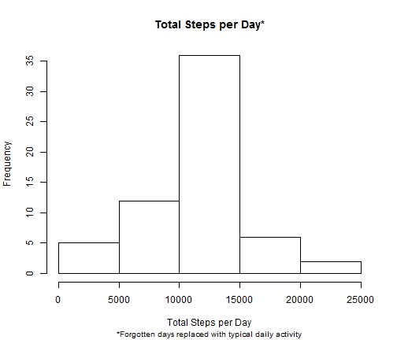

# Reproducible Research: Peer Assessment 1

Let's "unzip" and Load the data


```r
## Loading and preprocessing the data
unzip("activity.zip")
actdata <- read.csv("activity.csv")
```


Let's begin the analysis by looking at daily total activity.


```r
## What is mean total number of steps taken per day?  Sum up steps for common
## dates
daysum <- aggregate(actdata$steps, list(actdata$date), FUN = sum, rm.na = T)
```


```r
hist(daysum$x, xlab = "Total Steps per Day", main = "Total Steps per Day")
```

 


We see the histgram is roughly symmetric with most days falling the 10,000 to 15,000 step interval.


Looking at the mean and median, the are very close in value conforming the near symmetry.

```r
mean(daysum$x, na.rm = T)
```

```
## [1] 10767
```

```r
median(daysum$x, na.rm = T)
```

```
## [1] 10766
```


Now, let's take a closer look at daily activty patterns.


```r
# What is the average daily activity pattern?  Averaging the steps taken per
# per time interval
intmean <- aggregate(actdata$steps, list(actdata$interval), FUN = mean, na.rm = T)
# changing the interval to a time of day for formatting and to avoid
# 'jumping' in interal at the end of the hour
intmean$inttime2 <- as.POSIXct(sprintf("%04.0f", intmean$Group.1), format = "%H%M")
```


```r
# with Time
plot(intmean$inttime2, intmean$x, type = "l", main = "Average Daily Activity Pattern", 
    xlab = "Time of Day", ylab = "Number of Steps")
```

 


There appears to be a lot of activty in the morning between roughly 8:00 and 9:00.  Perhaps
our subject sneaks in an excersize walk/run or some time at the gym before starting their day.


```r
# Max steps and interval

max(intmean$x)
```

```
## [1] 206.2
```

```r
# max time
intmean$inttime[which.max(intmean$x)]
```

```
## [1] "2014-05-18 08:35:00 EDT"
```

```r
# max interval
intmean$Group.1[which.max(intmean$x)]
```

```
## [1] 835
```


We see the maximum step interal of just over 200 at 8:35 in the morning.  While this is a slow pace
for walking or running, it is an average so the runs or walks might not occur everyday. 

Looking closer at the data we noticed some intevals that had generated no activity.

```r
## Imputing missing values

# number of NA's
sum(is.na(actdata$steps))
```

```
## [1] 2304
```


There were 2304 5-minute intervals which came from 8 days without any generated activity.  
Assuming these may have been days where the subject forgot to wear the step counter we 
will replace these with the mean daily steps for that time interval. 


```r
actna <- which(is.na(actdata$steps))
actdata$stepsall <- actdata$steps
actdata$stepsmean <- intmean$x
actdata[actna, 4] <- actdata[actna, 5]
```


What did replacing these "forgtten" days with typical activity?  Let's look at the daily total
activity as well as the mean and median for the adjusted data.


```r
# New w/ NA as Int Mean

daysumnona <- aggregate(actdata$stepsall, list(actdata$date), FUN = sum, rm.na = T)
```


```r
hist(daysumnona$x, xlab = "Total Steps per Day", main = "Total Steps per Day*", 
    cex.sub = 0.8, sub = "*Forgotten days replaced with typical daily activity")
```

 


```r
mean(daysumnona$x, na.rm = T)
```

```
## [1] 10767
```

```r
median(daysumnona$x, na.rm = T)
```

```
## [1] 10767
```


Not much change in the histogran expect for the middle interval where we added the 8 "forgotten"
days.  The mean and the median are now the same due the to addition of 8 "exactly" average days.

Does our subject have different daily patterns on weekdays verses weekends?

```r
## Are there differences in activity patterns between weekdays and weekends?

# Classify days at Weekday or weekend

actdata$daytype <- "weekday"
actdata$daytype[weekdays(as.Date(actdata$date)) == "Sunday" | weekdays(as.Date(actdata$date)) == 
    "Saturday"] <- "weekend"
actdata$daytype <- as.factor(actdata$daytype)


# Subset data by daytype
actwkday <- subset(actdata, actdata$daytype == "weekday")
actwkend <- subset(actdata, actdata$daytype == "weekend")
```


```r
## For both weekend and weekday subset, averaging the steps per time interval
## Also formating interval as time so as to avoid jumps at end of the hour
intmeanwkday <- aggregate(actwkday$stepsall, list(actwkday$interval), FUN = mean, 
    na.rm = T)

intmeanwkday$inttime <- as.POSIXct(sprintf("%04.0f", intmeanwkday$Group.1), 
    format = "%H%M")

intmeanwkend <- aggregate(actwkend$stepsall, list(actwkend$interval), FUN = mean, 
    na.rm = T)

intmeanwkend$inttime <- as.POSIXct(sprintf("%04.0f", intmeanwkend$Group.1), 
    format = "%H%M")
```


```r
par(mfrow = c(2, 1))
par(mar = c(1.1, 4.1, 4.1, 2.1))
plot(intmeanwkday$inttime, intmeanwkday$x, type = "l", main = "Average Daily Activity Pattern", 
    , ylab = "Number of Steps")
par(mar = c(4.1, 4.1, 1.1, 2.1))
plot(intmeanwkend$inttime, intmeanwkend$x, type = "l", xlab = "Time of Day", 
    main = "", ylab = "Number of Steps")
```

 


The subject appears to be more active throughout the weekend days than during the week.  The 
weekend still show a spike in activty in the morning just before 9:00.
